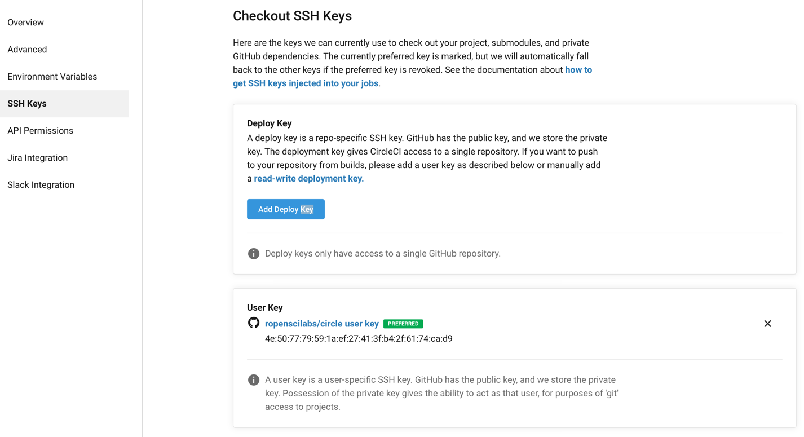

```{r, include = FALSE}
knitr::opts_chunk$set(
  collapse = TRUE,
  comment = "#>"
)
```

# Introduction

To be able to run builds from a repository, it needs to be enabled on Circle CI first.
This package heavily relies on GitHub for automatic user information extraction and other providers such as GitLab or Bitbucket are not supported.
In general Circle CI builds can be run from any Git hosting provider.

# Authentication with GitHub

To get started with Circle CI on GitHub, make sure to install the [Circle CI GitHub App](https://GitHub.com/marketplace/circleci) and configure the "Free" plan for your account.

The first time any {circle} function is called, it will check for the existence of a Circle API key.
This API key is needed to securely talk to the Circle CI API and make requests on behalf of a user.
There are two ways the API key can be set:

  - (**recommended**) Via environment variable `R_CIRCLE` in `~/.Renviron` (e.g. `R_CIRCLE = <API KEY>`)
  - In `~/.circleci/cli.yml` via the following pattern

   ```yml
   host: https://circleci.com
   endpoint: graphql-unstable
   token: <token>
   ```

To create an API key from the R console, `browse_circle_token()` can be used.

{circle} scrapes information about the current repository by making API calls to GitHub.
To be able to do this, a `GitHub_TOKEN` is needed (similar to the API requests for Circle CI).
It is good practice to have such a token set for many purposes when using R with GitHub.
Invoking `usethis::create_github_token()` is an easy way to create one if none exists yet.

# First steps

By querying information about the user and enabling a project one can check if everything was set up correctly.

`get_circle_user()` makes uses of the Circle CI API key.


```r
circle::get_circle_user()

$content
$content$name
[1] "Patrick Schratz"

$content$login
[1] "pat-s"

$content$id
[1] "9c373331-d0f7-45e1-afe6-4a5c75e00d10"


$path
[1] "/me"

$response
Response [https://circleci.com/api/v2/me?circle-token=39d697f345d8d8a92ab07c333405d9b0092d116c]
  Date: 2021-01-07 20:07
  Status: 200
  Content-Type: application/json;charset=utf-8
  Size: 86 B


attr(,"class")
[1] "circle_user"
```

`enable_repo()` also uses the GitHub token.

```r
circe::enable_repo()
✔ Successfully enabled repo 'ropensci/circle' on Circle CI.
```

After the repo has been enabled, it should be returned in `circle::list_projects()`.

# Deployment

Deployments refers to the practice to push (modified) files during a build to a repository.
Configuring build deployments can be a bit tedious with respect to permissions.
Here `circle::use_circle_deploy()` helps as it creates a SSH key pair which will enable deployment.
The private key will be stored in GitHub (under "Settings -> SSH and GPG keys") and the public key on Circle CI (on the respective project page in "SSH Keys").

```r
circle::use_circle_deploy()
✖ No 'user-key' found.
──────────────────────────────────────────────────────────────────────────────────────────────────
✔ Added a 'user key' to project '<repo-slug>' on Circle CI.
This enables deployment from builds.
```

To double-check, there should now be a "user-key" in your Circle CI repo settings under the menu point "SSH keys".
It does not matter if multiple "deploy key" or "user-key"s exists.
The important point is that one "user key" is set as "preferred".

```{r, echo=FALSE}

```

As an alternative to `circle::use_circle_deploy()` one could also click the "Add user key" button that would appear if no user key has been set yet.

## Deployment Keys

With respect to SSH keys, there two different types of keys on Circle CI:

- Deploy key

- User key

"Deploy keys" are used to checkout your repository so that the build is starting.
These kind of keys how only "read" permissions but are not allow to "write" to your repository.
If you have connected Circle CI to GitHub already, you will have a "deploy key" stored in every repository to be able to checkout the code.
The name "deploy" key here is a bit misleading since they **cannot** be used for deploying from builds.

To enable deployment to a repository however, a "user-key" is needed.
This key type also has "write" permissions and can be added using `use_circle_deploy()`.
`use_circle_deploy()` will add a so called "user key" to the settings of the repo on Circle CI.
The private key will be added to your GitHub profile under the "SSH and GPG keys" section with the title pointing to the respective repo.
See also [the Circle CI section about deployment](https://circleci.com/docs/deployment-integrations/).

(If for some reasons you do not want to use `use_circle_deploy()` and go the manual way of adding a SSH key to Circle CI, please be aware of [this issue](https://discuss.circleci.com/t/adding-ssh-keys-fails/7747).)

# Starting a Build

As with almost every CI provider, a YAML configuration files is required to specify the tasks that should be executed during a build.
Currently Circle CI does not come with official support for the R language but you can add [your vote here](https://ideas.circleci.com/images/p/add-official-support-for-r).
Since Circle CI is heavily based on docker this is not really a problem.
One can simply use the [rocker](https://github.com/rocker-org/rocker) R images to have first-class support with respect to R containers.
Official support for R would mean that the images are cached on Circle CIs side and be directly available on build start.
Currently, `rocker` images need to be downloaded in every build again.

{circle} does not come with a template for running R builds as it focuses on API and build metadata functionality.
Instead, have a look at [ropensci/tic](https://docs.ropensci.org/tic/) and its functions `tic::use_tic()` and `tic::use_circle_yml()` to quickly get R builds running on Circle CI.
Alternatively you can borrow the config that is being used [in this repo](https://github.com/ropensci/circle/blob/main/.circleci/config.yml) - which was also created via {tic}.
